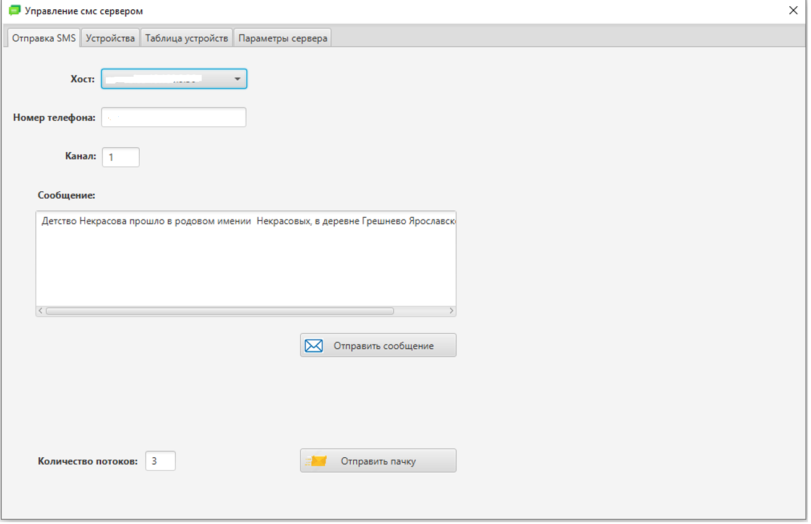
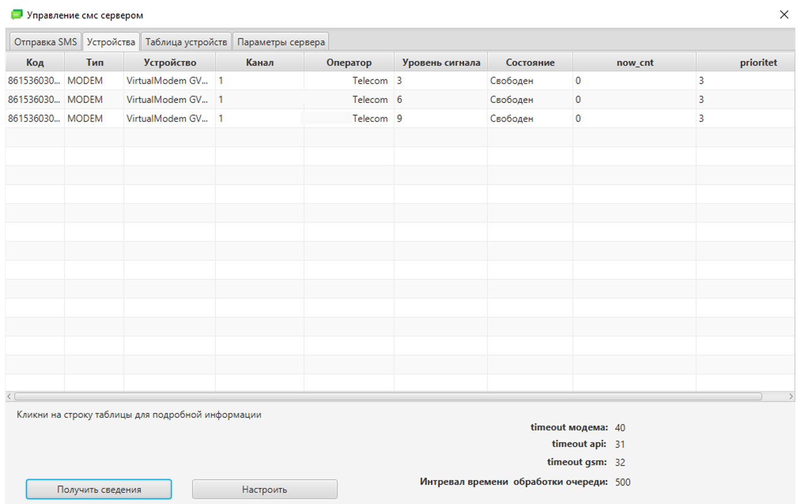
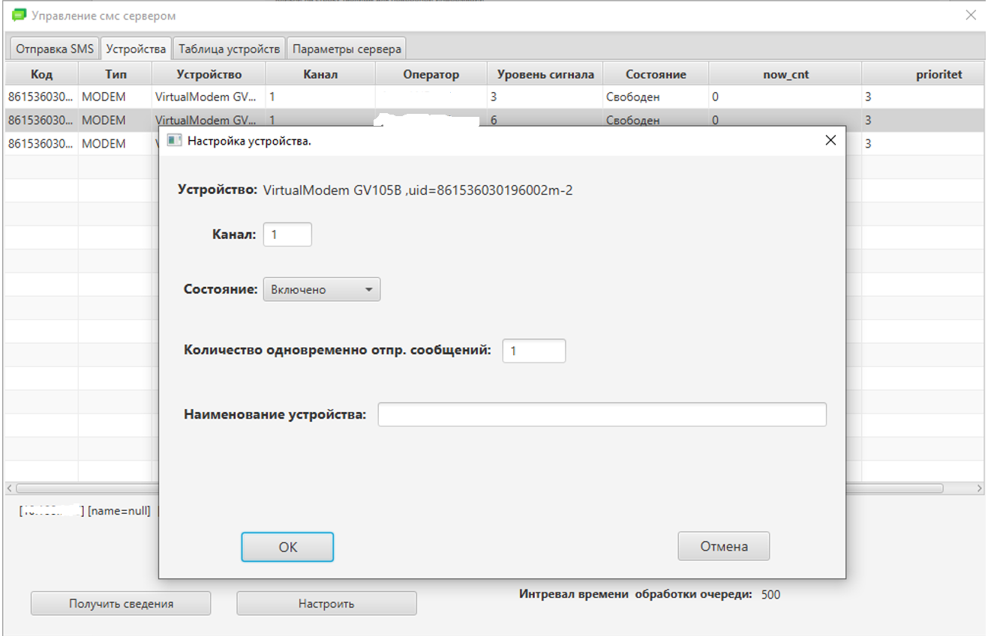

<h1 align="center">Сервер отправки SMS сообщений V1.00.</h1>

<h2 align="center">1. Общая информация.</h2>

Java,JavaFx приложение.

Сервер отправки SMS сообщений (далее SMS сервер) предназначен для отправки текстовых сообщений через GSM модемы, GSM шлюзы, АPI операторов связи.
Функции работы с GSM шлюзами, АPI операторов связи не предоставляются в данной версии.
Взаимодействие с сервером осуществляется посредством TCP протокола, через порт 3700.
 Инструкция по развертыванию находится в 
 "Развертывание СМС сервера.docx".

<h2 align="center">2. Требования к оборудованию.</h2>

Процессор Intel с частотой не ниже 2,4Ггц, не менее 2-х ядер;
не менее 4Гб оперативной памяти drr3;
Операционная система: Ubuntu 20.04.1 LTS, CentOS release 7.9.2009,
с установленной утилитой modem manager версии 1.12.8(Ubuntu), 1.6.10( CentOS 7.9);
JDK: OpenJDK версии 13.0.4(Ubuntu), 14.0.2 2020-07-14(CentOS) 
Модемы: Huawei E153.

<h2 align="center">3. Утилита администрирования SMS сервера.</h2>

Для настройки, мониторинга работы SMS сервера, используется утилита администрирования. Для работы утилиты необходим пакет jdk-13.0.1.

